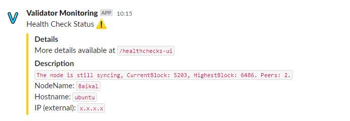

# Monitoring Node's Health

Nethermind **1.9.51** version comes with a pre-packed `Nethermind.HealthChecks.dll` plugin that allows you to monitor your Nethermind node better. It leverages the power of [AspNetCore.Diagnostics.HealthChecks](https://github.com/Xabaril/AspNetCore.Diagnostics.HealthChecks). It simply adds an`/health`endpoint to the JSON RPC service which can be used to check the Nethermind's _**liveness** -_ verify if the node is **synced** and has **at least one peer.** Useful when you don't want to query the node before it's able to provide you data available only for fully synced nodes like `eth_getBalance`.

The `Nethermind.HealthChecks.dll`plugin will be automatically loaded on Nethermind start.

## Enabling and configuring Health Checks

The health checks need to be additionally enabled which can be done either through `--HealthChecks.*` flags or by adding a `"HealthChecks"` section to the config file. 



```bash
  "HealthChecks": {
    "Enabled": true,
    "WebhooksEnabled": true,
    "WebhooksUri": "https://slack.webhook",
    "UIEnabled": true,
    "PollingInterval": 10,
    "Slug": "/api/health"
  }
```




JSON RPC Service needs to be enabled in order for health checks to work `--JsonRpc.Enabled true`


Each configuration option is described here: 



#### Enabling Health Checks without UI 

```bash
./Nethermind.Runner --HealthChecks.Enabled true
```

The `health` endpoint is now available at `localhost:8545/health`  by default \(if your `--JsonRpc.Port` is `8545`\). The `health` endpoint can be configured via `--HealthChecks.Slug` parameter e.g. `--HealthChecks.Slug /api/health`. We can if it is working with `curl`:

```bash
// Request
curl localhost:8545/health

// Example of response for Unhealthy node
{"status":"Unhealthy","totalDuration":"00:00:00.0015582","entries":{"node-health":{"data":{},"description":"The node has 0 peers connected","duration":"00:00:00.0003881","status":"Unhealthy","tags":[]}}}

// Example of response for Healthy node
{"status":"Healthy","totalDuration":"00:00:00.0015582","entries":{"node-health":{"data":{},"description":"The node is now fully synced with a network, number of peers: 99","duration":"00:00:00.0003881","status":"Healthy","tags":[]}}}
```

* **Unhealthy** returns **503** \(Service Unavailable\) status code
* **Healthy** returns **200** status code

#### Enabling Health Checks UI

```bash
./Nethermind.Runner --HealthChecks.Enabled true --HealthChecks.UIEnabled true
```

Enabling UI will expose an additional endpoint `/healthchecks-ui`and will allow seeing node's health on a nice UI. To view the UI simply go to `http://localhost:8545/healthchecks-ui`.


#### Enabling Slack reports

We may also add Slack Webhook endpoint to which our node's health will be reported. We need to pass the `--HealthChecks.WebhooksEnabled true` and add  the `--HealthChecks.WebhooksUri` which can be found in your Slack app configuration.

```bash
./Nethermind.Runner --HealthChecks.Enabled true --HealthChecks.UIEnabled true --HealthChecks.WebhooksEnabled true --HealthChecks.WebhooksUri https://hooks.slack.com/
```

If your node will be **Unhealthy** you should receive a message similar to this:



with description of why the node is unhealthy, node's name and information about the machine on which the node is running.  
When it becomes **Healthy** \(**synced** and with **peers**\) you should receive:


#### HealthChecks for producing and processing blocks

In version v.1.10.18, we introduced additional behavior for health checks. We added two fields for HealthChecks config: MaxIntervalWithoutProcessedBlock and MaxIntervalWithoutProducedBlock. The node will return unhealthy status if the interval elapsed without processing or producing a block. Let's use the below config as an example. If the node doesn't process a block for 15 seconds, we will return unhealthy status. Analogically, we will be waiting 45 seconds for a newly produced block.



```bash
  "HealthChecks": {
    "Enabled": true,
    "WebhooksEnabled": true,
    "UIEnabled": true,
    "Slug": "/api/health",
    "MaxIntervalWithoutProcessedBlock ": 15,
    "MaxIntervalWithoutProducedBlock": 45
  }
```



If we don't set those fields in a config application will try to use them based on seal engine specification. You can see concrete values in the tables below. If we have infinity time, we can still report unhealthy status if our processing or producing threads stopped.

| Seal engine | Processing interval | Producing interval |
| :--- | :--- | :---: |
| Clique | 4 \* Period | 2 \* Period \* SingersCount |
| Aura | 4 \* StepDuration | 2 \* StepDuration \* ValidatorsCount |
| Ethash | 180 | Infinity |
| Custom/NethDev/None | Infinity | Infinity |

#### health\_nodeStatus

In version v.1.10.18, we've also introduced health checks via JSON RPC requests. To do that, we should have HealthChecks.Enabled set to true.



```
{ "jsonrpc":"2.0","method":"health_nodeStatus","params":[],"id":67 }
```



```text
{
    "jsonrpc": "2.0",
    "result": {
        "healthy": false,
        "messages": [
	        "Stopped processing blocks",
            "Node is not connected to any peers"
        ]
    },
    "id": 67
}
```



